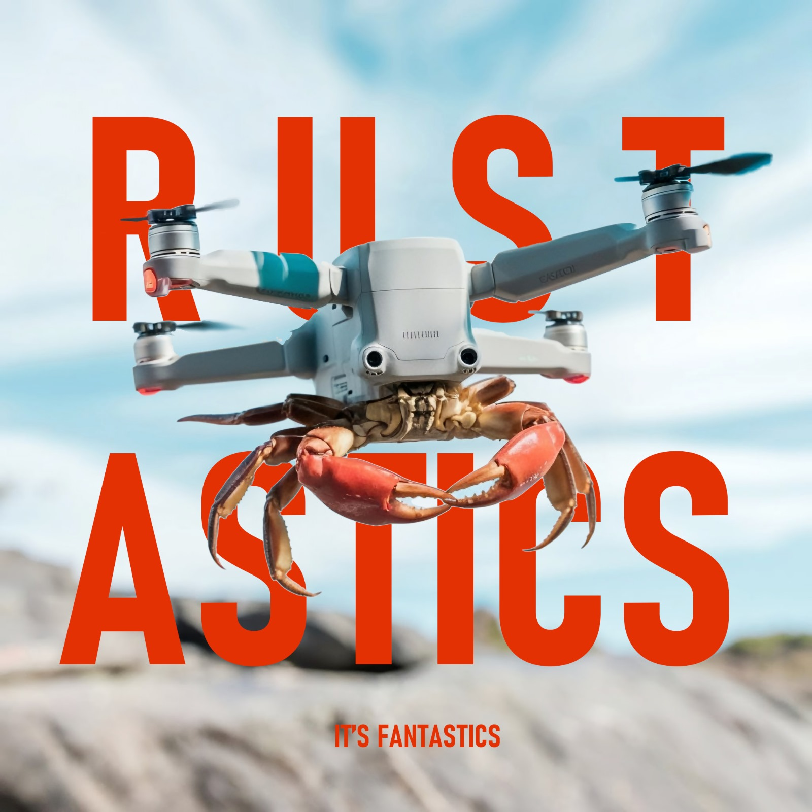

# 🦀 Rustastic 🦀

**Rustastic** is a student project group formed for the **Advanced Programming** course at the **University of Trento**.  
Our work focuses on building a simulation of a drone-based communication network using the Rust programming language.

## Members
- Andrea Carzeri
- Alessandro Busola
- Giulio Bosio
- Andrea Denina

## Roles
- Andrea Carzeri:
  - [Servers](https://github.com/Rustastic/Servers)
  - [Part of the drone](https://github.com/Rustastic/RustasticDrone)
- Alessandro Busola:
  - [NetworkInitializer](https://github.com/Rustastic/NetworkInitializer)
  - [SimulationController](https://github.com/Rustastic/SimulationController)
  - [GUI](https://github.com/Rustastic/GUI)
- Giulio Bosio:
  - ...
- Andrea Denina:
  - ...
